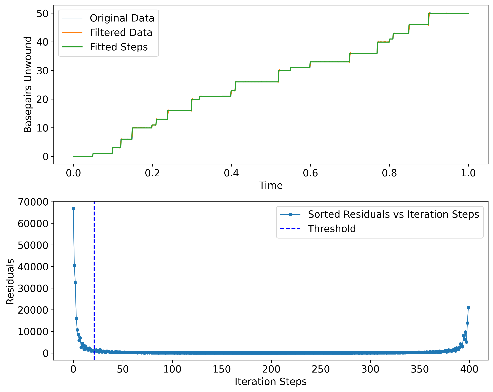
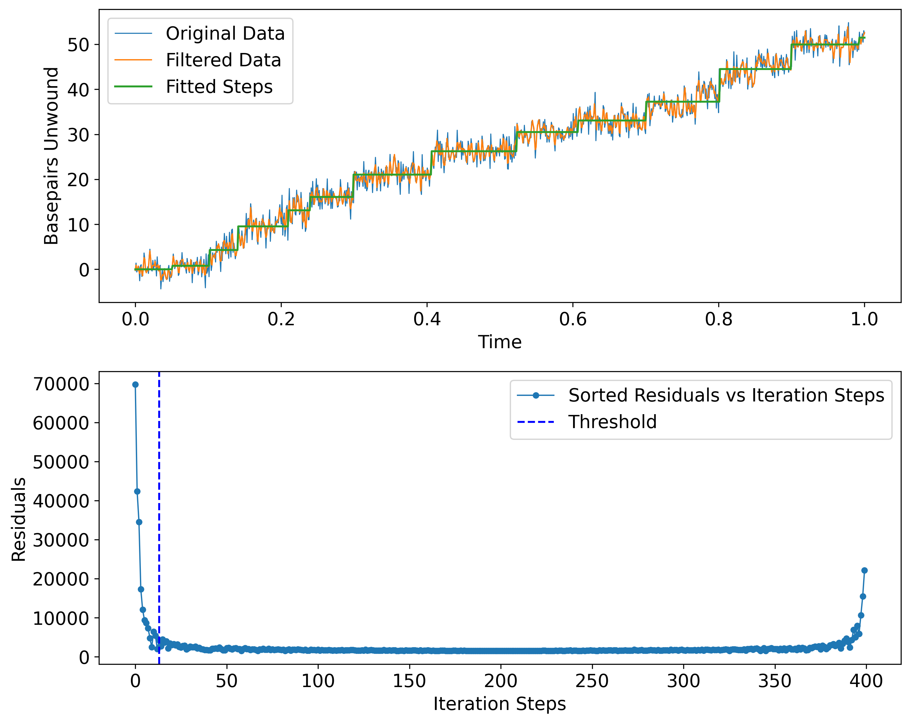
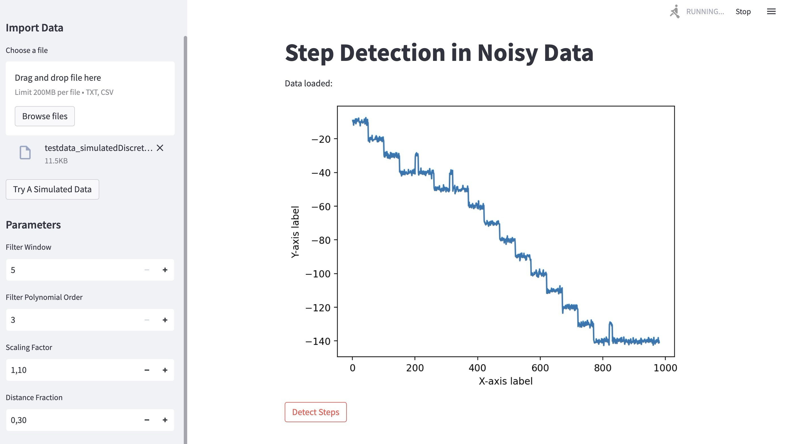
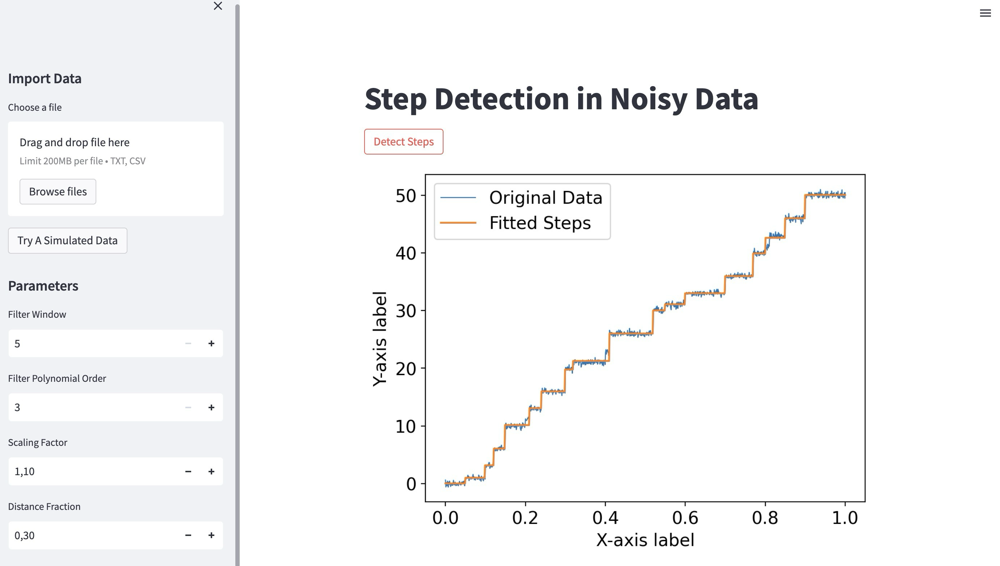

# Step Detection in Noisy Data

This Python script provides a method for detecting step locations and sizes in step-like traces with Gaussian noise. The method involves generating a step-like trace, estimating the noise level, filtering the noise, and finally detecting step locations and sizes. All codes listed in this repository are developed by Longfu Xu during the phD work in Gijs Wuite Group, to investigate the DNA replication at the single-molecule level.

## Table of Contents

- Introduction
- Methodology
- Algorithm Detailed Outline
- Usage
- Use in an UI app
- Citation

## Introduction

In many applications, we are interested in analyzing step-like behavior in data where sudden changes occur. Such data can be affected by Gaussian noise, making it challenging to identify the exact locations and magnitudes of these steps. This document presents a method for generating simulated step-like data, estimating the noise level, filtering the noise, and detecting the step locations and sizes in the data. We also provide a discussion on the underlying theory behind each step of the process.

## Method

1. **Generate a step-like trace with Gaussian noise:**

   The first step in the process is to generate a simulated dataset that consists of a step-like signal with steps of varying size and duration, hidden in Gaussian noise with a root mean square (RMS) amplitude (σ). The `generate_step_data` function is used for this purpose, taking the following parameters:

   - `n_points`: The number of data points in the dataset.
   - `step_locs`: A list of the relative positions of the steps in the dataset.
   - `step_sizes`: A list of the sizes (magnitudes) of the steps.
   - `noise_std`: The standard deviation of the Gaussian noise.

   The function creates a step-like signal by adding the step sizes at the specified locations and then adds Gaussian noise with the given standard deviation.

   Example:

   ```python
   n_points = 4000
   step_locs = [0.05, 0.1, 0.12, 0.15, 0.2, 0.21, 0.24, 0.3, 0.32, 0.4, 0.41, 0.52, 0.55, 0.6, 0.7, 0.77, 0.8, 0.81, 0.85, 0.9]
   step_sizes = [1, 2, 3, 4, 1, 2, 3, 4, 1, 2, 3, 4, 1, 2, 3, 4, 1, 2, 3, 4]
   noise_std = 1.5
   x, data = generate_step_data(n_points, step_locs, step_sizes, noise_std)
   ```
   
2. **Estimate the noise level:**

   In real-world applications, the standard deviation of the Gaussian noise may not be known. The `estimate_noise_std` function estimates the noise level by calculating the median absolute deviation (MAD) of the differences between consecutive data points and scaling it with a factor (e.g., 1.4826) to obtain an unbiased estimate of the standard deviation.

   Example:

   ```python
   estimated_noise_std = estimate_noise_std(data)
   ```
   
3. **Filter the noise:**

   To reduce the impact of noise on the step detection process, we apply the Savitzky-Golay filter to the data. This filter smooths the data by fitting a polynomial of a specified order to a sliding window of data points and replaces the central data point with the fitted value. The `savgol_filter` function from the `scipy` library is used for this purpose, with the following parameters:

   - `window_length`: The length of the sliding window (must be an odd integer).
   - `polyorder`: The order of the polynomial used in the local regression.

   Example:

   ```
   from scipy.signal import savgol_filter
   
   window_length = 51
   polyorder = 3
   filtered_data = savgol_filter(data, window_length, polyorder)
   ```
   
4. **Find the step locations and sizes:**

   The core of the method is identifying the step locations and sizes in the filtered data. We use the `find_optimal_steps` function, which iteratively fits single steps to the data and calculates the residuals between the data and the fitted steps. The function sorts the steps by their sizes and filters out the steps that are smaller than a threshold (e.g., the estimated noise standard deviation). The optimal steps and step sizes are then combined based on the indices of the original sorted arrays.

   Example:

   ```python
   optimal_step_locs, optimal_step_sizes = find_optimal_steps(filtered_data, step_size_threshold=estimated_noise_std)
   ```
   
5. **Reconstruct the fitted curve:**

   To visualize the results, we can reconstruct the fitted curve using the detected step locations and sizes. The `reconstruct_fitted_curve` function is used for this purpose, taking the following parameters:

   - `x`: The array of x values (independent variable).
   - `data`: The original noisy data.
   - `optimal_step_locs`: The detected optimal step locations.
   - `optimal_step_sizes`: The detected optimal step sizes.

   The function creates a new array with the same shape as the input data and adds the detected step sizes at the optimal step locations.

   Example:

   ```
   fitted_curve = reconstruct_fitted_curve(x, data, optimal_step_locs, optimal_step_sizes)
   ```
   
6. **Plot the results:**

   Finally, we can plot the original data, filtered data, and the fitted curve to visualize the effectiveness of the method.

   Example:

   ```
   import matplotlib.pyplot as plt
   
   plt.figure()
   plt.plot(x, data, label="Original Data")
   plt.plot(x, filtered_data, label="Filtered Data")
   plt.plot(x, fitted_curve, linestyle='--', color="r", label="Fitted Curve")
   plt.legend()
   plt.show()
   ```

**Discussion**

The method presented in this document provides a systematic approach to detecting step-like behavior in data affected by Gaussian noise. The use of a noise estimator, a noise filter, and an iterative step-fitting algorithm allows for accurate detection of step locations and sizes, even in cases where the noise level is high or unknown.

However, the method's performance can be affected by the choice of filter parameters, such as the window length and polynomial order in the Savitzky-Golay filter. These parameters should be chosen carefully to balance noise reduction and preserving the original signal's features. Additionally, the method assumes that the noise is Gaussian, which may not always be the case in real-world data.

Despite these limitations, this method provides a robust starting point for detecting steps in noisy data and can be further refined and adapted to specific applications as needed.

## Algorithm Detailed Outline

1. **Generate a step-like trace with Gaussian noise:**

   - Define the number of points, step locations, step sizes, and noise standard deviation.
   - Use the `generate_step_data` function to create a simulated dataset with the given parameters.

2. **Estimate the noise level:**

   - Estimate the standard deviation of the Gaussian noise present in the data using the `estimate_noise_std` function.
   - This function calculates the median absolute deviation (MAD) of the differences between consecutive data points and scales it with a factor (e.g., 1.4826) to estimate the standard deviation.

3. **Filter the noise:**

   - Apply the Savitzky-Golay filter to the data using the `savgol_filter` function from the `scipy` library.

   - Choose an appropriate window length (odd integer) and polynomial order for 

   - the filter, ensuring that the window length is large enough to smooth the noise but small enough to preserve the step features.

     1. **Detect step locations and sizes:**
        - Use the `fit_single_step` function to fit a single step to the filtered data, calculate the residuals, and find the best location for the step.
        - Apply the `find_optimal_steps` function to iteratively find the optimal step locations and sizes based on the calculated residuals.
        - Define a minimum step size threshold, typically equal to the estimated noise standard deviation, and filter out the steps with sizes smaller than this threshold.
        - Recalculate the step sizes by taking the mean difference between adjacent optimal step locations.
     2. **Reconstruct the fitted curve:**
        - Use the `reconstruct_fitted_curve` function to reconstruct the fitted curve based on the optimal step locations and recalculated step sizes.
        - This function iteratively adds the recalculated step sizes to the fitted curve, starting from the optimal step locations.
     3. **Visualize the results:**
        - Plot the original data, the filtered data, and the reconstructed fitted curve.
        - Display the optimal step locations and recalculated step sizes in a clear and concise manner.
        - You can customize the plots (e.g., colors, labels, markers) to make the visualization more informative and appealing.
## Usage

Simply run the Python script `test.py` to generate synthetic step-like data with Gaussian noise, apply the Savitzky-Golay filter to smooth the data, estimate the noise level, and detect the steps using the custom step-fitting algorithm. The script will output the step locations and sizes, as well as the estimated noise level.

#### Noise std = 0.05

#### Noise std = 0.1

#### Noise std = 2


## Use in an UI app 
```bash
streamlit run app.py
```
then open Local URL: http://localhost:8501 with your default browser to do the test


### you can also generate simulated data to test


## Citation
Xu, L. (2023) Grab, manipulate and watch single DNA molecule replication. PhD-Thesis - Research and graduation internal. Available at: https://doi.org/10.5463/thesis.424.

---
### Disclaimer
Please note that the code in this repository is custom written for internal lab use and still may contain bugs; external support cannot be guaranteed.

### Contributing
If you feel like contributing to the project, please do! Bug fixes, enhancements, visual fixes etc. are always welcome. If you want to implement something big: Please start a discussion about that! 

### About Me
[Longfu Xu](https://www.longfuxu.com) . Maintenance, development, support. For questions or reports, e-mail: l2.xu@vu.nl

---
